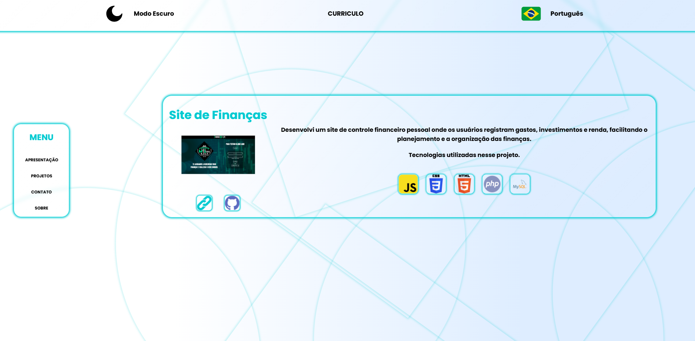
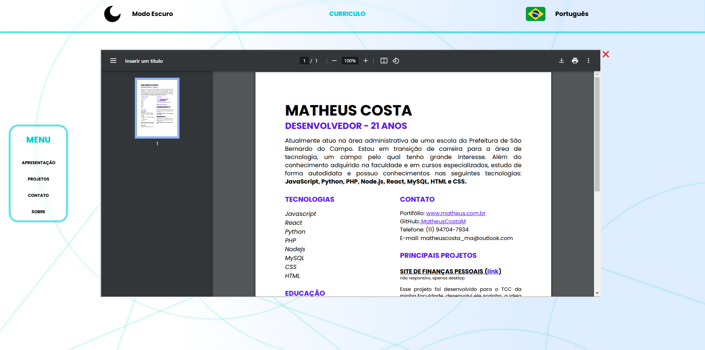

# Portfólio Pessoal

Este é o meu portfólio pessoal desenvolvido com **React**, onde você pode conhecer mais sobre mim, minhas formações, tecnologias que utilizo e os projetos que já desenvolvi. A página conta com recursos como **modo noturno e claro** e **internacionalização** (tradução entre português e inglês).

## Funcionalidades

### 1. **Modo Claro e Escuro**

O portfólio oferece a funcionalidade de alternar entre os modos **Claro** e **Escuro**. O tema é alterado dinamicamente com o uso do `ThemeProvider` do `styled-components`. Ao clicar na opção de troca de tema, o layout do portfólio será ajustado para o modo escolhido.

### 2. **Internacionalização (Tradução em Português e Inglês)**

A aplicação foi desenvolvida com a biblioteca `react-i18next`, permitindo alternar entre os idiomas **Português** e **Inglês**. O conteúdo textual da página (como seções sobre mim, meus projetos e formações) é traduzido dinamicamente, proporcionando uma experiência personalizada para diferentes idiomas.

### 3. **Seções do Portfólio**

O portfólio é composto pelas seguintes seções:

- **Tecnologias**: Exibição das principais tecnologias que eu domino e utilizo em meus projetos.

- **Projetos**: Lista dos meus projetos anteriores, com descrições e links para mais detalhes.

- **Sobre Mim**: Apresentação pessoal, incluindo minhas informações de formação e experiência.

- **Formações**: Detalhes sobre minha formação acadêmica e cursos realizados.

- **Currículo**: Currículo disponibilizado em pdf.

## Tecnologias Utilizadas

- **React**: Biblioteca principal para construção da interface do usuário.
- **Styled Components**: Usado para estilizar os componentes da página de forma dinâmica.
- **React-i18next**: Biblioteca para implementar a internacionalização e suporte a múltiplos idiomas.
- **React Hooks (useState)**: Para gerenciamento de estado dos componentes, como tema e idioma.
- **ThemeProvider**: Para gerenciar e aplicar temas claros e escuros.
- **Smooth Scroll**: Para navegação suave entre as seções da página.

